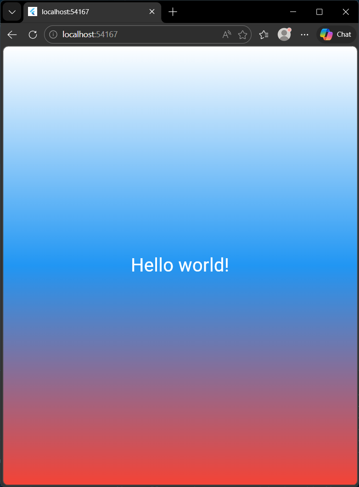

# Flutter Лабораторная работа №2

Проект, созданный в рамках второй лабораторной работы по знакомству с фреймворком Flutter. Приложение демонстрирует базовые принципы построения UI, работу с виджетами и управление состоянием.

## Информация об авторе

**Имя:** Катаржин Г.М.

**Группа:** ИСП-232

## Стек и версии

*   **Flutter:** 3.35+
*   **Dart:** 3.x.x
*   **Платформа:** Web (Edge)
*   **IDE:** VS Code

## Скриншот приложения

## Запуск

1.  Клонировать репозиторий
2.  Перейти в папку проекта
3.  Выполнить `flutter pub get`
4.  Запустить командой `flutter run -d chrome`

## Что изучили

*   Структура Flutter-проекта и назначение основных файлов и папок.
*   Основы работы с виджетами: `MaterialApp`, `Scaffold`, `Container`, `Center`, `Text`.
*   Принципы декларативного UI и построение дерева виджетов.
*   Использование Hot Reload и Hot Restart для быстрой разработки.
*   Стилизация интерфейса: градиенты, цвета, текстовые стили.